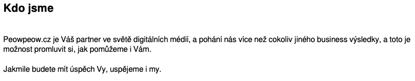

K sepsání tohoto příspěvku mě přiměla špatná zkušenost. Naštěstí ne moje, ale zprostředkovaná. Klientka (třeba Mirka)
mé přítelkyně si nechala, na doporučení své klientky (začíná se nám to komplikovat, co?) udělat web. Mirka dostala
kontakt na pána, který se tvářil solidně. Vše vysvětlil a tak sepsali smlouvu.

V průběhu vytváření webu se dodatečně měnily požadavky. Cena rostla. Z původních asi třiceti tisíců se rázem stalo
bezmála sto dvacet tisíc. Což je dost. Obzvlášť na kvalitu, kterou se snažil Mirce dodat. Proto Mirka chtěla odstoupit
od smlouvy a vrátit část zaplacených financí. Místo peněz na účet dostala nadávky do e-mailu. Po pohrození právníkem
web zmizel z internetu. Soudní znalec tak nemohl posoudit, zda stav stránek odpovídá, či neodpovídá zaplacené ceně...

Nyní se pokusím popsat, na co si dát pozor. Ať zbytečně nedopadnete jako Mirka. V závěru pak ukážu na příkladu, podle
čeho mohla Mirka hned na začátku poznat, že do spolupráce s Arturem Vlkem jít neměla.

# Na co si dát pozor

## 1. Recenze, recenze, recenze ...

Prvním krokem by vždy měla být důkladná lustrace. Možná jdete na doporučení, možná jste viděli na internetu reklamu. Tak
je to jistota, ne? No, popravdě není. Několikrát se mi stalo, že doporučení dával někdo, kdo vlastní stránky ani neměl.
Nebo třeba z doporučení něco měl...

Pro jistotu tedy zadejte jméno společnosti nebo jednotlivce do vyhledávače. Připojte slovíčko "recenze" nebo "zkušenosti".
Prohledejte jejich Facebookové stránky, recenze na Google, diskuse. Prostě vše, co se dá najít.

Mohou nastat asi tři situace:

### Recenzí je hodně a jsou většinou kladné
Máte štěstí, očividně jste dostali dobrý tip. Můžete dát na recenze a dál nic nezjišťovat. Pokud ve vás ale stále hlodá
červík nejistoty a chcete si být opravdu jistí - čtěte dál.

### Recenzí je dost a jsou většinou špatné
Tady asi není co řešit. Proč zkoušet štěstí? I kdyby vám dotyčný nabízel sebelepší cenu, vždy je lepší poohlédnout se
někde jinde. Ve výsledku se cena často vyšplhá na úplně jinou částku a vy skončíte stejně, jako ostatní.

### Recenzí je málo nebo nejsou žádné
Pravděpodobně jste si pro své stránky vybrali jednotlivce, nebo malou firmu. Absence recenzí ještě nic neznamená, ale
bude potřeba být více ostražití.

## 2. Stránky dodavatele

Jako další krok bych doporučil navštívit stránky tvůrce nebo dané firmy. Líbí se vám? Ne? Tak možná zkuste pohledat
jiného dodavatele. Pokud si nedají práci s vlastní prezentací, která jim má vydělávat peníze, jak můžete čekat, že si
dají práci s tou vaší?

## 3. Portfolio

Seznam stránek, které dotyčný (či firma) vytvořil pro ostatní zákazníky je cenný zdroj informací. Často je seznam
dostupný přímo na stránkách. Ideálně i s odkazy. Našli jste odkazy? Super! Proklikejte je. Prohlédněte si, jak stránky
fungují. Líbí se vám?

> Tady bych rád poznamenal, že portfolio bez odkazů **NENÍ** portfolio. Když stránky není možné projít a proklikat, může
> to znamenat, že web už dávno nefunguje. Jde o starou referenci, která není relevantní. Nebo, v horším případě, stránky
> nikdy ani neexistovaly.

## 4. Nacenění

Sepiště, co všechno stránky mají umět. A opravdu sepište, nemávněte jen rukou s tím, že to "vykomunikujete" osobně.
Buďte detailní. Každá minuta, kterou strávíte nad popisem se vám několikanásobně vrátí na penězích za dodatečné úpravy.

> Je to stejné, jako byste po spisovateli chtěli, aby uprostřed rozepsaného románu nějakou postavu úplně odstranil,
jinou přidal a celý text napsal v angličtině. Občas to mohou být i malé změny, které znamenají, že se vše
musí předělat od začátku.

Zkuste si tedy odpovědět na následující otázky. Rozhodně nejde o ucelený seznam, ale snad naznačí, nad čím vším je
třeba přemýšlet:

- **Chcete obsah upravovat sami?** - Například přidávat novinky, psát blog, měnit ceník, přidávat nové položky do e-shopu?
  - Web, který budete moci upravovat sami je složitější vytvořit/nastavit. Pravděpodobně po vás budou chtít vyšší částku
    na začátku. Nicméně ušetříte za dodatečné úpravy, protože je provedete sami.
  - Pokud úpravy necháte na někom jiném, bude pravděpodobně cena tvorby webu nižší. Ušetříte i na provozních nákladech.
    Na druhé straně musíte počítat s tím, že za každou změnu si zaplatíte. A možná tučně.

- **Chcete kontaktní formulář?** - Ten by vám doručoval do e-mailu zprávy od zákazníků.

- **Chcete cenovou kalkulačku?** - Například po zadání váhy a rozměrů a vzdálenosti by stránky měly umět vypočítat cenu
  za přepravu zboží (v případě dopravní společnosti).

- **Chcete e-shop, prodávat kuzy, vstupenky?** - Pokud ano, budete chtít umožnit platbu kartou online? Máte specifické
  požadavky na platební metody (platba Apple Pay, Google Pay, Paypal, Klarna, ...). Chcete provázání s dopravci (vyhledání
  nejbližší pobočky zásilkovny, sledování stavu doručení na vašich stránkách).

- **Kolik máte zákazníků?** - Jestli ještě nemáte webové stránky, kolik zákazníků vás sleduje na Facebooku, Instagramu nebo
  jiné sociální síti? Kolik zákazníků přichází do provozovny?

- Budete na stránce chtít vložit recenze z Google, Heuréky nebo seznam vašich příspěvků na Instagramu?

- Jde vám o unikátní vzhled?

- Chcete k webu i e-mailovu adresu?

Zkuste v rámci nacenění požádat i o popis technického řešení. Ptejte se, proč vybrali zrovna tento postup. Jaké jiné
možnosti zvažovali a proč je nakonec nevybrali. Konkrétně. Nemusíte přitom technickým názvům a pojmům rozumět. Sledujte, zda se
zamysleli nad vašim konrétním případem. Stejně jako s oblečením, ani jedno technické řešení nesedne všem.

> Jestli tedy nezvažovali žádné jiné řešení, než to nabízené, je docela pravděpodobné, že nedostanete za své peníze to
nejlepší řešení. Odpověď "takhle to u nás děláme" není to, co chcete slyšet.

## 5. Smlouva

Předchozí body vás neodradily. Máte nejspíš šťastnou ruku! Vámi vybraný dodavatel vypadá solidně. Fanfáry,
a šampus ještě odložte. Čeká vás to nejdůležitější. Smlouva. Malá písmenka a právnické floskule. Často
rozdíl mezi spokojeným a naštvaným zákazníkem.

Bohužel nejsem právník, abych mohl vypsat seznam nějakých právnických kliček, na které si je lepší dát pozor.
Uvažujete-li do stránek investovat hodně peněz, vždy k podpisu přizvěte právníka. Ve výsledku ušetříte.

K čemu se snad vyjádřit mohu, jsou části smlouvy týkající se technické stránky:

### Typ smlouvy
Vždy trvejte na smlouvě "na dílo". To znamená, že budete platit za hotové a funkční stránky.

Dopředu tak víte co dostanete. A kolik za to zaplatíte. Pokud nebudete měnit v průběhu požadavky, bude to i cena finální.

> Někteří fiškuntálové vás možná budou tlačit do smlouvy "za hodiny". V takovém případě byste platili každou
hodinu, kterou na vytváření webu stráví. Problém je, že jsem snad nikdy nezažil, že by se původní odhad hodin nezvýšil.
Vždy se najde nějaká cesta. To či ono trvalo déle. Někde jste neupřesnili své požadavky dostatečně detailně a bylo to
nutné předělat. Nebo prostě hodiny vyfakturují metodou "cucprst". Tedy *kolik peněz ještě
potřebuju na Vánoce + 20% navíc*. A prokazujte zpětně, že těch hodin je nějak moc. Obzvlášť, když začnou
chrlit seznam zkratek, anglických termínů a "technických" důvodů proč ke zvýšení došlo.

### Rozsah plnění

Co to znamená "funkční a hotové" by mělo být zaneseno do smlouvy. Má být vytvořen nový vzhled na míru? Do smlouvy s
tím! Má být možné na webu kupovat vstupenky na divadelní vystoupení? Do smlouvy s tím. Chcete na web přidat poslední
recenze zákazníků z Heuréky? Do smlouvy s tím! Asi si rozumíme, že?

### Další drobnosti

Smlouva by měla v nějaké formě obsahovat i pasáže věnující se následujícím drobnostem:

- Před vytvořením stránek vám bude ukázán návrh vzhledu. Ideálně i více návrhů. Několik změn návrhu (po vaší zpětné vazbě)
  by mělo být v ceně.

- Budete průběžně informování o stavu vývoje.

- Nechtějí celou částku předem. Záloha je naprosto normální, ale celá částka by měla být doplacena až při předání.

- Smlouva popisuje, v jakém případě je možné odstoupit od smlouvy a případné penále.

- Popis technického řešení. Například, že web poběží na Wordpressu, bude hostován u Wedosu a doménu zakoupí u Forpsi.
  Budou nainstalovány ty a ty doplňky.

## 6. Průběžné kontroly
Trvejte na průběžných kontrolách. Na začátku chtějte ukázat návrh nebo návrhy vzhledu. Nelíbí-li se vám, mohou vzhled
přepracovat dříve, než vytvoří web. Ušetří tak práci. A vám peníze.

Po odsouhlasení vzhledu trvejte na tom, že dostanete odkaz na rozpracované stránky. Pravidelně kontrolujte, že se vše pohybuje správným směrem. Obsah by měl přibývat a
web se formovat. Opět se nebojte zasáhnout. Ptejte se, proč web vypadá tak či onak. Kontrolujte stav s tím, co je
popsáno ve smlouvě. Při odchylkách opět chtějte znát vysvětlení a případně nápravu.

## 7. Finílní kontrola

Před předáním webu proveďte finální kontrolu. Až potom je celý proces ukončený.

Zkontrolujte si:

- **Vzhled**. Vše musí odpovídat návrhu. Pokud ne, chtějte nápravu. Samozřejmě v ceně.

- **Texty**. Jsou čitelné (velikost, barva textu a pozadí)? Nejsou v nich hrubky, vulgarismy (pokud jste to zrovna
  nechtěli) a sedí s tím, co na stránkách chcete?

- **Obrázky**. Ujistěte se, že všechny obrázky se načítají, nejsou příliš velké, malé, nejsou špatné kvality a sedí do
  okolního obsahu.

- **Funkce**. Kontaktní formulář opravdu odesílá e-mail na vaši adresu. E-shop funguje a je možné provést objednávku.
  Příspěvky z Instagramu se načítají jak mají. Recenze fungují.

- **Administrace**. Pokud jste se rozhodli pro možnost editace obsahu svépomocí, dostali jste přístup do administrace.

## 8. Předání

Při předání by vám ještě jednou měli všechno vysvětlit. Jak jednotlivé části stránky fungují. Pokud má web administraci,
jak se do ní dostanete. Jak přidávat články, měnit ceník atd. Jakým heslem a jménem se přihlásit.

Dále chtějte přístupové údaje k e-mailu (pokud byl požadován k webu), převod domén na vaši firmu/osobu a předání přístupových
údajů k hostingu.

Až když máte všechny přístupové údaje, je web skutečně váš.

# Příklad

A nyní slíbený příklad. Protože teorie je hezká, ale jeden příklad vydá za deset stránek textu. Vrátíme se k Mirce, naší
podvedené. Ta sedla na lep pánovi jménem Artur Vlk. Stojí za stránkou peowpeow.cz. Postupně tedy krok po kroku:

## 1. Recenze

Po zadání hesla *Artur Vlk recenze*, *"peowpeow.cz" zkušenosti tvorba webu* žádné relevatní výsledky pravděpodobně
nedostanete. U druhého hesla pravděpodobně najdete dvě stránky, kde je v patičce uvedeno *S ❤ vyrobili v Peowpeow.cz*.

První stránky fungují, druhé nikoliv. Tím pádem víme, že Artur Vlk vytvořil minimálně dvě stránky. Bohužel recenze jsme
nenašli.

## 2. Stránky tvůrce

Po zadání adresy peowpeow.cz do prohlížeče se dostanete na stránky s anglickou textací. Kromě adresy v Brně, telefonního čísla a
emailu nic nedává tušit, že komunikujete s programátorem na volné noze z českých luhů a hájů. Stránky se snaží působit
světově. Dokonce obsahují seznam referencí. To určině nebude podvod Honzo, ne?

Zůstaňme ale chvilku na strance peowpeow.cz. Na stránkách se opakovaně vyskytuje citace spokojených zákazníků. Zkuste
zkopírovat a vyhledat jejich jméno. Že vám to nic relevantního nenašlo? Zajímavé, že?

<table>
    <tr>
        <td></td>
        <td></td>
    </tr>
    <tr>
        <td>Ukázka citace jedné spokojené zákaznice.   Paní Jane Mazhouli zde chválí PeowPeow za vzornou spolupráci při
            vytvoření tzv. minimálního životaschopného produktu. Prý ušetřili peníze a vše vyvinuli velice rychle.</td>
        <td>
            Kombinace jména paní a firmy Mind Power vrací stránky PeowPeow.cz. Očividně paní ani firma neexistuje.
        </td>
    </tr>
</table>

A podobná situace s "neexistencí" je i u ostatních domnělých zákazníků Artura Vlka.

## 3. Portfolio

Po proklikání jednotlivých referencí je třeba konstatovat, že vypadají dobře. Mají hezké animace a líbivou grafiku.
Jde totiž o stažené šablony ([reference](https://robobull.cloud), [šablona](https://www.elegantthemes.com/layouts/business/social-media-consultant-landing-page)).

Dále už vypíchnu některé, více či méně viditelné problémy:

- Referenční stránky uvedené na peowpeow.cz nejsou stránky reálných firem a produktů. Zkuste například kliknout na odkazy na sociální sítě.

- Referenční stránky obsahují mix češtiny, angličtiny a [Lorem Ipsum](https://cs.wikipedia.org/wiki/Lorem_ipsum).
  Neumím si představit, že by česká nebo zahraniční firma tento stav odsouhlasila.

- Referenční stránky sdílejí své zákazníky (Pitch, Wire, Real Wave, LoudNick, ...). Takový přesah u diametrálně rozlišných
  služeb je nepravděpodobný. Opět to ukazuje na použití šablon a v důsledku habaďůru na zákazníka.

<table>
    <tr>
        <td>Partněři webu Vizual.live</td>
        <td>
            
        </td>
    </tr>
    <tr>
        <td>Partneři webu Autoto.app</td>
        <td> </td>
    </tr>
</table>

## 5. Smlouva

Krok nacenění jsem záměrně přeskočil a přešel rovnou ke smlouvě. Zde je další vykřičník, který by se měl každému v
hlavě rozsvítit. Artur Vlk se ve všech materiálech snaží působit, jakože jedná za firmu. Ve skutečnosti je ale OSVČ
a celé jeho podnikání je one-man-show.

Samozřejmě, tým profíků vždycky působí líp, než jeden člověk. Nicméně pokud se jeden člověk snaží vydávat za tým,
úmyslně se vás snaží uvést v omyl.

# Závěr

Všechny tyto drobné náznaky by mohly dát tušit, že s Mirkou Artur Vlk nehrál čistou hru. Bohužel, většina z nich se
lépe hledá, když člověk ví, že Artur Vlk je podvodník. Víc se zaměřujete na detaily a šťouráte tam, kam byste se jinak
nepodívali.

I to je dobrá lekce. Vždy raději předpokládejte, že na druhé staně jednacího stolu sedí někdo, kdo vás chce přinejmenším
natáhnout na pěnězích, když ne rovnou podvést. Šťourejte do věcí. Ptejte se. Možná budete vypadat jako blbci, ale také
můžete zjistit, že sedíte u stolu s někým, s kým nechcete.
