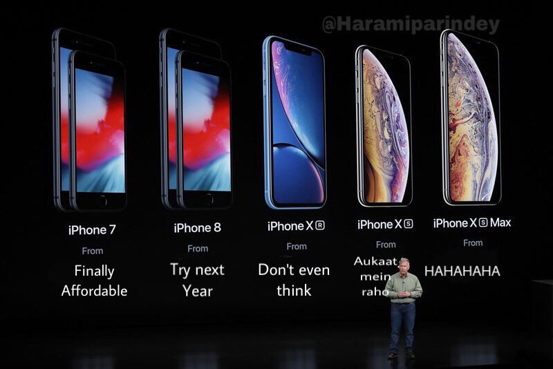

Je mi jasný, že přicházím trochu s křížkem po funuse. Na netu se z keynote válí hromada fotek, videí a článků. Jenže když já už jsem sledování věnoval tolik času. A navíc, žádný z těch "expertních" článků jsem nenapsal já! To už jsou hodně pádné důvody, abych taky něco sepsal, ne?

Píše se rok 2007. Už několik let se [šušká (EN)](https://www.fiercewireless.com/wireless/timeline-apple-iphone-rumors-1999-present), že Apple vydá svůj první telefon. Kromě názvu, který si Apple registroval s několikaletým předstihem, se toho příliš neví. Applu šel hype už tehdy, a proto se čeká, že to bude velké. Zájemcům nezbývá než se posadit v Moscone Center v Kalifornii na Macworld konferenci do předváděcí místnosti a netrpělivě vyčkat, co Steve představí. Jen těžko si představit, jaké to asi bylo. Minimum uniklých informací. Nikdo netušil, jak přesně bude telefon vypadat, jak se bude ovládat a jaké bude mít funkce. 

Bohužel za ta léta se tenhle příjemný pocit očekávání trochu vytratil. Malé Applí Vánoce byly tatam. S rozvojem internetu se i historicky schránčlivému Apple nepodařilo vždcky udržet informace pod pokličkou. Čím dál tím víc se prodlužovala doba mezi únikem "neoficiálních" informací a samotným představením telefonu. Korunu tomu nasadil rok 2018, kdy se už několik měsíců dopředu vědělo snad vše. Že půjde o představení tří modelů, jak velký budou mít display (a jaký typ), kolik foťáků, RAMky a kolik budou přibližně stát. Keynote jen potvrdil, co už se dávno vědělo.

## Hodinky

Jako první se na řadu dostaly hodinky. O jejich tvaru se vědělo dopředu a logicky vzato jde o očekávaný posun vpřed. Naštěstí Apple nezůstal jen u toho a mimo jiné přidal i elektrokardiogram. Jde o ten přístroj, který ve filmu plochou rovnou čarou a nepřerušovaným pískáním oznámí, že někdo umřel. Krom toho se údajně hodí na měření srdečního tepu a varování před nepravidelným rytmem. Bohužel se zatím Apple nedohodnul s EU a tak nebude tahle funkce v Evropě dostupná.

## Telefony
Jak jsem už psal, byly představeny tři modely - iPhone Xs, Xr a Xs Max.

<blockquote class="twitter-tweet" data-lang="en">
Whoever named the new iPhones XR, XS and XS Max should be fired.   iPhone XS, M and XL. It was right there...<a href="https://twitter.com/hashtag/AppleEvent?src=hash&amp;ref_src=twsrc%5Etfw">#AppleEvent</a> <a href="https://twitter.com/hashtag/iPhone2018?src=hash&amp;ref_src=twsrc%5Etfw">#iPhone2018</a>
&mdash; The Slickest of Pimpsta’s (@Slick_Pimpsta) <a href="https://twitter.com/Slick_Pimpsta/status/1039947150518611968?ref_src=twsrc%5Etfw">September 12, 2018</a></blockquote>

Pro mě byl nějvětší novinkou nový procesor A12 - se stejným cool názvem jako jeho předchůdce - Bionic. Úplně z toho srší ta výpočetní síla. Co se Apple musí nechat, je, že jde o první vydaný procesor vytvořený se 7nm technologií (jen pro zajimavost: první oznámený byl Kirin 980). Když se vezme v potaz, že s touto "velikostí" má třeba Intel stále problémy, jde asi o velký počin.

## Hodnocení

K ostatním novinkám se vyjadřovat moc nebudu. Z mého pohledu vlastníka věčně prázdné penězenky jsou právě hodinky a telefony jediným vstupním bodem do ekosystému Apple. Bohužel prodeje posledního X-kového modelu Applu ukázaly, že ani tisíc dolarů není žádná hranice. A tak přitlačil. Nový model Xs sice startuje na stejné ceně, ale to prosím za 64 GB interní paměti. Za stejný peníz máte Note 9 s 128 GB a s tím už se dá fungovat. 

XR-kový model - údajně "dostupný" pro masy - startuje na 23 tisících. Což je plus mínus jeden [český plat](https://www.czso.cz/csu/czso/cri/prumerne-mzdy-1-ctvrtleti-2018). Za tu cenu dostanete krásných 64 GB paměti, jen jeden foťák a LCD displej. Tedy, oni mu říkají Liquid Retina, protože to zní líp.

V [papírovém porovnání](https://mobilenet.cz/clanky/nove-iphony-od-applu-jak-se-lisi-od-svych-predchudcu-srovnani-36040) jen těžko budete hledat znatelný rozdíl oproti loňským modelům. Jde to i ruku v ruce se stylem, jakým byl keynote veden. Apple se tradičně rád chlubí čísly - nový procesor je o X% rychlejší, foťák o Y% detailnější atd. Ve středečním představení bylo čísel žalostně málo. Například Face ID zůstalo po hardwarové stránce stejné. Díky novému procesoru by mělo být rozpoznání tváře rychlejší. Ovšem tím informace končí - žádná přesná čísla. Uvidíme, až se dostanou telefony prvním recenzantům do ruky, ale tipuji, že omnoho rychlejší Face ID nebude.

## Závěr

Trochu váhám co napsat. Na jednu stranu si nemyslím, že jde o špatné telefony. Na rozdíl od iPhone 8, který podle mě nikdy neměl vyjít, jsou to krásné kousky, které (alespoň co se vzhledu týče) patří do roku 2018. Bohužel Apple je stále Apple a ždíme své zákazníky, kde může. Což je škoda. Protože minimálně hodinky by mohly pomoci spoustě srdcařů. Jenže k hodinkám za deset tisíc je potřeba ještě mobil. Pominu-li bazar, nejlevnější "nový" telefon stojí přes dvacet tisíc. Právě cena může být rozdíl mezi zachráněným životem a smrtí. Ale o chudáky v Cupertinu nikdy nešlo.

<video preload="auto" poster="https://img-9gag-fun.9cache.com/photo/aBx7MAx_460s.jpg" style="min-height: 336.522px; width: 600px;" controls><!----> <source src="https://img-9gag-fun.9cache.com/photo/aBx7MAx_460svvp9.webm" type="video/webm"> <source src="https://img-9gag-fun.9cache.com/photo/aBx7MAx_460sv.mp4" type="video/mp4"> <source src="https://img-9gag-fun.9cache.com/photo/aBx7MAx_460svwm.webm" type="video/webm"></video>
