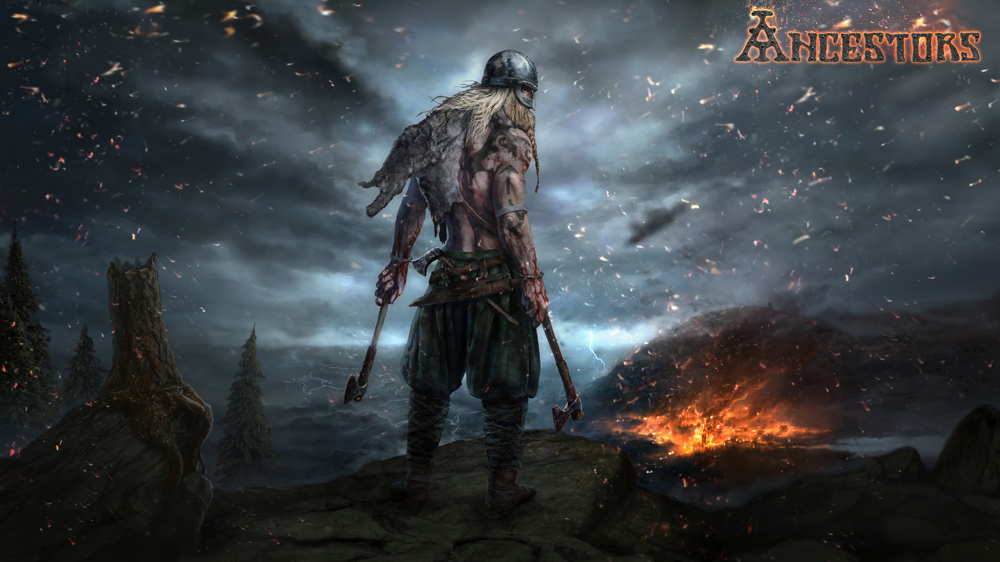
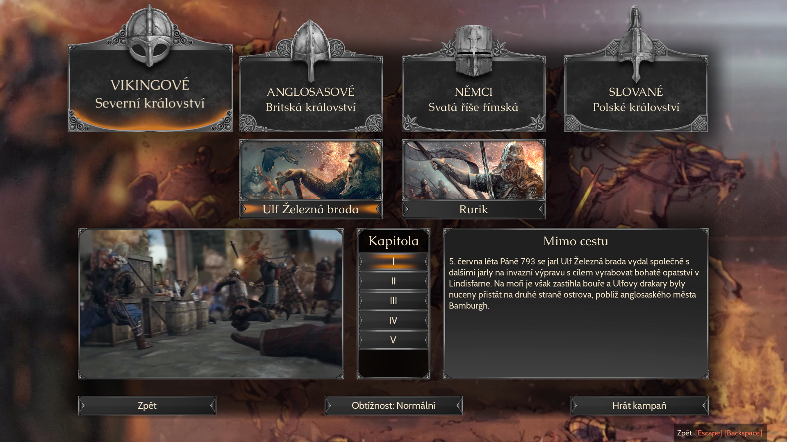
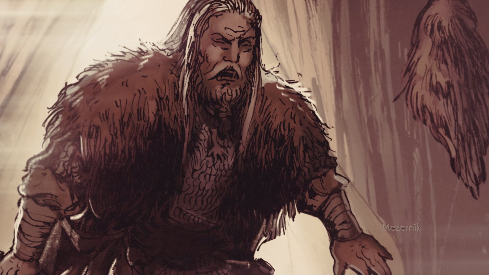

Ne, že bych zrovna na strojárně uplatnil znalost severské mytologie. Ale dejme tomu, že studuji historii zpracování a využití kovu v přímém přenosu.

Ancestors je relativně nová hra - vyšla terpve 22. května. Podle těch pár dostupných videí na Youtube vypadá trochu jako Battle for the Middle Earth. Tedy hra, u které jsem s kamarády trávil čas před maturitou, a ke které se velice rád vracím. Sice tu chybí lore Středozemě, zato jsou tu Vikingové! Kdo by mohl takovému pokušení říct ne?

Během stahování (ze Steamu, kapišto) jsem slintal nad kráskou grafikou a hrozně se těšil, až přijdu ze školy a konečně vyplundruju nějakou britskou vesnici. 

Přivítala mě krásná úvodní obrazovka s kreslenou animací s výjevy z bitevní vřavy doplněná epickým vikingským zpěvem. 

<iframe width="560" height="315" src="https://www.youtube-nocookie.com/embed/3Tk0uNwm5qI?controls=0&amp;showinfo=0" frameborder="0" allow="autoplay; encrypted-media" allowfullscreen></iframe>

Protože mě všichni kamarádi nechali na holičkách a neměl jsem nikoho, s kým bych si zarhál multiplayer, sáhl jsem po kampani. Můžete hrát za Vikingy, Anglosasy, Němce a Poláky (v tomhle pořadí). Zatím jsem dohrál jen kampaň za Vikingy (a pár sólových her proti počítači) a z ní budu v dalším hodnocení vycházet. Myslím, že jsem se hrou strávil dostatek času, abych si mohl udělat obrázek (doslova).

Prvních několik misí je v podstatě tutoriál. A za sebe můžu říct, že výborný. Nenutí vás posouvat kamerou, označovat jednotky a procházet cesty označené červeným křížkem. Od první minuty máte pod kontrolou jednotky, bojujete a zabijíte.

Jste v roli Vikingů, kteří se původně vydali vyplenit opatství Lindisfarne. Před odjezdem málo upláceli Aegira a tak jejich lodě přistály u silně bráněného města Bamburgh. Během několika okamžiků se z "vem si co chceš, chlapíci s vyholenou hlavou ti fakt bránit nebudou" zájezdu stala krvavá řež. Vikingové i přes četné úspěchy (*samozřejmě čistě velitelského rázu*) dostanou co proto. Uprchnou do lesů a vašim úkolem coby velitele je dát je dohromady. V nepřátelském prostředí sehnat dostatek jídla, shromáždit roztroušené Vikingy a dát sasíkům za vyučenou.

Jednotlivé mise jsou nápadité. Obsahuje záškodnické "stealth" mise s několika málo vojáky, úpěnlivé bránění pevnosti do posledního muže nebo monumentální (s jedním a to prosím cizím katapultem) obléhání pevnosti. Při tom jste provedeni celou hrou, takže v posledních několika kapitolách už hru ovládáte jako svoje boty. 

## Jak se to hraje

Ancestors jsou v jádru kovanou RTS. Stavíte základnu, těžíte suroviny a snažíte se umlátit nepřítele. Nic co by vás mělo překvapit. Každý z těchto prvků ale v sobě má určitou část originality. 

Tak prvně, ve své základně nestavíte budovy jen tak, hala bala kam se vám z rozmaru (nebo strategie) zachce, ale jsou pro ně předem určené pozice. Kliknutím na ikonu stavby se budova sama postaví. Vesničany nijak přímo neovládáte.

Jakmile máte dostatek vojáků, abyste vyrazili na dobyvačné výpravy, musíte se porozhlédnout po okolí. Na mapě jsou rozmístěné vesnice, jejichž zabráním si přivlastníte suroviny a nevolníky. Ty pak můžete poslat těžit kámen, sbírat jídlo nebo kácet přilehlé lesy. Ne v každé vesnici jsou všechny suroviny což přináší jistý prvek strategie do jejich výběru.

Plundrováním vesnic a hlavně zabíjením nepřátel vaše jednotky získávají zkušenosti. Když jich mají dostatek, přejdou na vyšší úroveň a vy můžete vybrat jedno ze tří zaměření. To se liší dle typu jednotky. Například pro kopiníky jde o rychlost, útok a obranu. Jednotek můžete mít jen deset. Ztráta i jedné "naskillené" jednotky dost zabolí. Často se budete stahovat, jednotky doplňovat a opět posílat zpět do boje. 

## Co se povedlo

Psal jsem to už v úvodu a napíšu to pro jistotu ještě jednou. Grafika je krásná. Jasný, není to ten druh grafiky, kdy si s wow výrazem ve tváři sednete na zadek (za předpokladu že u hry stojíte). To u strategie tak trochu čekám. Jde přesně o tu grafiku, která nezestárne. Age of Empires, Battle for the Middle Earth a určitě spousta dalších her jsou zářným příkladem.

Třešničku na dortu je Akční kamera, kdy si hru můžete přiblížit až k jednotkám a sledovat jak se řežou takřka jako byste stáli vedle nich. (Což jako správný velitel co? Neděláme.)

Výborně je na tom i optimalizace. Celou dobu jsem hrál na ultra nastavení a jediná chvíle, kdy se hra trochu zadýchala byla při videích načítací obrazovky. Jinak vše běží velice plynule i na starším počítači.

Jako poslední bych rád vyzdvihl dolní panel. Z něho máte přístup ke všem jednotkám a vesnicím. Nemusíte je procházet jednu po druhé. Vše zařídíte klávesovými zkratkami, zatímco sledujete své jednotky v týlu nepřítele.

## Co se nepovedlo

Ancestors stejně jako ostatní strategie doprovází nešvary s AI. Jasně, jde o strategii, takže mozek operace mám být já. Nemůžu být všude. A trochu bych očekával, že v nové hře nebudou štítonoši ostřelovaní lukostřelcemi stát jako tvrdé Y, koukat do (na) blba a nechávat se pomalu odkráglovat. Stačila by nějaká volba - agresivní (zkusili by štěstí a zaútočili) - pasivní (stáhli by se z dostřelu). Jasně, přineslo by to spoustu dalších problémů (ústup směrem k nepříteli, dál od mé základny, nebo by se při agresivním postupu nechali zabít atd.). Ale stále by šlo o lepší řešení, než tohle. 

Dalším příkladem je situace vzniklá při dobývání pevnosti v kampani za Vikingy. Drsným Vikingům už bylo zatěžko se plahočit lesy a loukami a štrádali si to na férovku po cestě těsně před palisádami nepřítele. Kde na ně samozřejmě dostřelili lukostřelci. Asi jsem nedostal ty nejostřejší pastelky v penálu.

Hlavní a největší problém Ancestors je pro mě nemožnost plně ovládat jednotky v boji. Jakmile se jednou přiblíží k nepříteli, začnou bojovat a jediný příkaz na nějž reagují je stáhnout se. To zamrzí o to víc, když hra obsahuje prvky jako je přepadení, útok zezadu a obklíčení, které mají efekt na morálku.

Kdykoliv jsem chtěl vpadnotu něpříteli do zad, musel jsem jednotku opatrně manévrovat oklikou kolem nepřítele. Snažit se ji držet z dosahu, aby se nepřidala do vřavy a já nad ní neztratil kontrolu. Do poslední chvíle držet bersekery vzadu, aby mohli zaútočit vyrazit na nechráněné lukostřelce, zatímco se moje armáda v jednom velkém chumlu řezala s tou nepřátelskou. 

Možná to zní malicherně, ale pro mě šlo o extrémně flustrující zážitek. V základně krom naklikání pár budov není co dělat a neposlouchající jednotky mi vzaly i tu poslední radost - z boje.

## Ragnarok

Celkově je Ancestors relativně dobrá hra. Má pěknou grafiku, dobrou hudbu a kampaň. Map je dostatek, jsou členité a různorodé. Ve čtyřech hratelných národech si asi každý najde to svoje. Co trochu pokulhává je hratelnost. Jakmile naklikáte jednu kasárnu jde už jen o co nejrychlejší "spawnování" jednotek. V boji jim ve správný čas aktivujete některou ze schopností a pak čekáte. Koukáte na houf vojáků, ve kterém bojují první tři řady a říkáte si, že tu "Palbu do vlastních řad", kterou sem tam způsobí vaši šikovní lukosřelci si snad i zaslouží.
